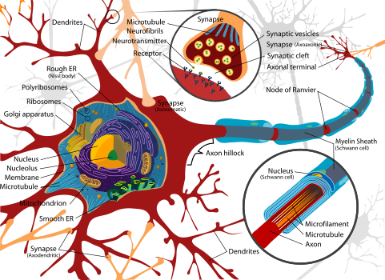
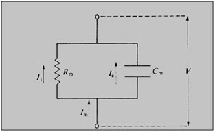
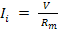
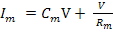
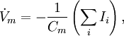
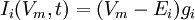

 

## What are Neurons ?
 

In this section, we address a specific subject biophysicists have been studying --- neurons. A neuron is a nerve cell that is the basic building block of the nervous system. A one-year old human has about 100 billion (1011) neurons. A typical brain neuron will have connections with at least 1,000 other neurons. 

The brain is a vastly complicated signalling system, with neurons forming the basis of that system. Electrochemical signals flow in one direction only in neurons, originating at the dendrites or cell body (usually in response to stimulation from other neurons) and propagating along axon branches which terminate on the dendrites or cell bodies of perhaps thousands of other neurons. The connections between the ends of axons and the dendrites or cell bodies of other neurons are specialized structures called synapses.

 &nbsp;

 

 

## Neuronal Function
 
The basis of neuronal electrochemical signals lies in the neuron membrane. Like all cell membranes, the neuron membrane is a phospholipid bilayer. In other words, the membrane is a "fat sandwich", with fatty acids between two slices of polar (phosphate) "bread". The membrane is pierced with proteins that serve as channels for ions to "flow" though (like straws stuck in a sandwich).

The two ion-channels in the axon (both voltage-gated) allow passage of positive ions of sodium (Na+) and potassium (K+). A pump in the cell membrane (the "sodium pump") actively transports sodium ions out of the cell, and potassium ions into the cell, in a ratio of 3 sodium per 2 potassium. This creates a voltage (potential) difference across the membrane of -70 millivolts. Lowering this potential increases the probability that ion-channels will open. Once some ion channels begin opening, the voltage drops further, causing more channels to open until the membrane depolarizes. Sodium channels are more sensitive to voltage change than potassium channels are, and open more rapidly. Thus, in a depolarization, the sodium ions will rush into the axon faster than the potassium ions will rush out. This sudden depolarization (called an action potential) will briefly result in a +30 millivolt potential difference. Once the slowly-opening voltage-gated potassium ion-channels have opened and allowed potassium to flow out, the action potential is ended. Thus, the sodium ion-channels initiate the action potential, and the potassium ion-channels terminate it. The channels then close, and the sodium pump can restore the resting potential of -70 millivolts. But the action potential will propagate down the axon toward the synapse like a line of falling dominos.

 

## Neuronal modeling
 
We model the neuronal cell membrane as a resistor in series with a capacitor as the diagram below illustrates.

 

Figure: Model of Cell Membrane

 &nbsp;
 
When a voltage is applied as illustrated, a current will flow through this circuit and partition itself into two components, 

 
 
 &nbsp;

Ii is the ionic current across the resistor and Ic is the current which flows through the capacitor. For the ionic current, 

 
 
 &nbsp;

where Rm is the membrane resistance. The capacitative current is proportional to the rate at which the voltage changes and is proportional to

 
 
 &nbsp;
 This,  

 
                          

 &nbsp;
 

**Hodgkin-Huxley model of the excitable neuron**
 

The Hodgkin–Huxley model is a scientific model that describes how action potentials in neurons are initiated and propagated. It is a set of nonlinear ordinary differential equations that approximates the electrical characteristics of excitable cells such as neurons and cardiac myocytes. The components of a typical Hodgkin–Huxley model are shown in the figure. Each component of an excitable cell has a biophysical analog. The lipid bilayer is represented as a capacitance (Cm). Voltage-gated ion channels are represented by nonlinear electrical conductances (gn, where n is the specific ion channel), meaning that the conductance is voltage and time-dependent. This was later shown to be mediated by voltage-gated cation channel proteins, each of which has an open probability that is voltage-dependent. Leak channels are represented by linear conductances (gL). The electrochemical gradients driving the flow of ions are represented by batteries (En and EL), the values of which are determined from the Nernst potential of the ionic species of interest. Finally, ion pumps are represented by current sources (Ip).
The time derivative of the potential across the membrane *Vm* is proportional to the sum of the currents in the circuit. This is represented as follows:

 

 &nbsp;

where *Ii* denotes the individual ionic currents of the model.

 

## Ionic current characterization
 

The current flowing through the ion channels is mathematically represented by the following equation:

 

 

&nbsp;

 

where Ei is the reversal potential of the i-th ion channel.
In voltage-gated ion channels, the channel conductance gi is a function of both time and voltage (gn(t, V) in the figure), while in leak channels gi is a constant (gL in the figure). The current generated by ion pumps is dependent on the ionic species specific to that pump.

 

**Resting membrane potential**

 

Knowing the concentrations of K+ and Na+ ions inside the cell and in the extracellular matrix allows us to calculate the Nernst potential for those ions. For EK we obtain a transmembrane voltage of –75 mV, and for ENa we obtain +55 mV. It is easily seen that since in the resting state the membrane potential is –70 mV and it is closer to the Nernst potential of K+, there will be a weak electromotive force of –5 mV pushing potassium ions toward the extracellular space, while for the sodium ions there will be a strong electromotive force of +125 mV pushing the sodium ions toward the cellular protoplasm.

It is well known that the membrane potential at rest is kept by the action of the K+/Na+ pump. It opposes and counteracts to the mentioned electromotive forces above and throws out 3 Na+ ions – exchanging them for 2 K+ ions. The active pumping of the K+/Na+ pump however spends energy in the form of ATP. That is why the resting potential is an “unresting”, actively sustained biological state of the membrane. It therefore is a unstable state far from the equilibrium. It gets easily destroyed when the K+/Na+ pump is blocked, e.g. by administration of *ouabain.*

 

**Generation of the action potential**
 

An action potential (or nerve impulse) is a transient alteration of the transmembrane voltage (or membrane potential) across an excitable membrane generated by the activity of voltage-gated ion channels embedded in the membrane. Action potentials play multiple roles in several types of excitable cells such as neurons, myocytes, and electrocytes. The best known action potentials are pulse-like waves of voltage that travel along axons of neurons.

The classical experiments with the use of squid axons showed that the action potential is generated via transient increase of the Na+ conductivity of the membrane, and in some cases increase of Ca2+ conductivity. If the rise of the conductivity simply were a transient breakdown in permeability to allow all ions to move across the membrane, it would only depolarize the membrane to zero, not beyond. However the membrane depolarizes reaching +50 mV, whence the mechanism of action potential generation must include selective increase of conductivity only of a certain type of ions, e.g. the sodium ones.

Hodgkin & Huxley described the mechanism that produces this inward rush of sodium ions in response to a small depolarization of the squid axonal membrane. After applying a brief depolarizing impulse above certain threshold value, the voltage-gated sodium channels open. The energy for it is provided by the electrochemical gradient of Na+ across the membrane, according to the principles already outlined above. The explosive nature of the flow of Na+ ions, triggered by an initial, small depolarization of the membrane, is due to the voltage-sensitive properties of the Na+ channel protein. A positive feedback loop process is started.

When the membrane begins depolarizing, it causes the Na+ conductance to start an increase that depolarizes the membrane further. This in turn increases the Na+ conductance, and so on. This is the kind of self-reinforcing regenerative relation that characterizes various kinds of devices; a similar relation between heat and chemical reaction, for example, underlies the explosion of gunpowder. One can say that it is the property that puts the “action” into the action potential. It gives the impulse a threshold, below which it fails to fire, above which it is fully successful: one thus says that it is “all-or-nothing”.

The successful transmission of information along the axon, nevertheless, requires inactivation of the voltage-gated sodium channels at a certain step. Otherwise the whole membrane would be depolarized, until it reaches about +50 mV inside and it settles in this excited state. If it were the case, no subsequent information could be transmitted. Actually the voltage-gated sodium channels get inactivated when the membrane potential reaches +40 mV, preventing such situation.

Another important biological consequence of the sodium channel inactivation is the interposition of a refractory period during which any potential applied, even over the threshold, does not initiate any action potential. The existence of a refractory period allows the action potential to propagate along the axon without re-exciting another action potential. Concurrent with the sodium channel inactivation a further important process is started – voltage-gated K+ channels do open and quickly restore the resting membrane potential, even slightly overcompensating it, a process known as hyperpolarization.

The interplay of voltage-gated (i) sodium inward rush, (ii) sodium channel inactivation and (iii) potassium efflux shifted in time allows the neurons generate action potentials that propagate in one direction in the form of solitary waves. The propagation of the action potentials is different in unmyelinated axons, myelinated axons and dendrites.
